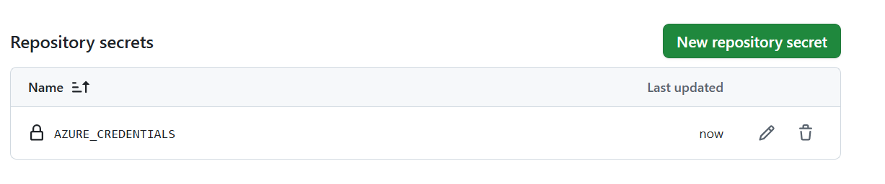

# Project: Automated Deployment of a Serverless Static Website

## Project Overview

This project demonstrates a modern, serverless web architecture on Microsoft Azure. It includes a static HTML/CSS website hosted on Azure Blob Storage, an automated CI/CD deployment pipeline using GitHub Actions, and an event-driven serverless function using Azure Functions.

The primary goal was to build a hands-on project showcasing skills relevant to Junior Cloud and DevOps roles, including automation, Infrastructure as Code principles (scripted resource creation), and serverless computing.

### 🔴 Live Website URL: [https://tanushreestorage123.z1.web.core.windows.net/](https://tanushreestorage123.z1.web.core.windows.net/)

---

## Architecture Diagram

This diagram illustrates the workflow from development to deployment and backend processing:

```
[Developer] --(git push)--> [GitHub Repository]
     |
     +--> [GitHub Actions CI/CD] --(Deploy)--> [Azure Blob Storage (Static Website)] <-- [End User Browser]
     |
[Image Upload] ----> [Azure Blob Storage (Uploads Container)] --(Triggers)--> [Azure Function (Processes Image)]
```

---

## Technologies & Skills Demonstrated

*   **Cloud Platform:** Microsoft Azure
*   **Core Services:** Azure Blob Storage, Azure Functions (Serverless), Azure Resource Groups, Azure IAM.
*   **Automation & CI/CD:** GitHub Actions, Azure CLI, YAML.
*   **Languages & Tools:** Bash Scripting, HTML, CSS.
*   **Version Control:** Git & GitHub.
*   **Key Concepts:**
    *   Serverless Architecture
    *   Infrastructure as Code (IaC) via scripting
    *   CI/CD Automation (Continuous Integration/Continuous Deployment)
    *   Event-Driven Processing & Triggers
    *   Cloud Security (Service Principals, IAM Roles, Least Privilege)
    *   Static Site Hosting

---

## Project Walkthrough & Screenshots

### 1. Azure Resource Provisioning
All resources were provisioned within a single Resource Group, `MyServerless-RG`, using the Azure CLI. This includes two storage accounts (one for the website, one for the function) and the serverless Function App.


### 2. CI/CD Pipeline with GitHub Actions
A CI/CD pipeline was created using a YAML file (`.github/workflows/deploy.yml`). This pipeline automatically triggers on every `git push` to the `main` branch. It securely logs into Azure using a Service Principal stored in GitHub Secrets and deploys the website's source code.


### 3. Live Static Website
The deployed static website is hosted directly from Azure Blob Storage. This is a highly scalable and cost-effective solution for serving web content.


### 4. Event-Driven Serverless Function
An Azure Function with a Blob Storage trigger was deployed. It automatically executes whenever a new image file is uploaded to the `samples-workitems` container. The invocation log below shows the function successfully triggering and logging the name of the uploaded blob.


### 5. Secure Authentication
A Service Principal was created in Azure and assigned the 'Storage Blob Data Contributor' role, following the Principle of Least Privilege. Its credentials were stored as an `AZURE_CREDENTIALS` secret in GitHub to ensure a secure, passwordless authentication from the pipeline to Azure.


